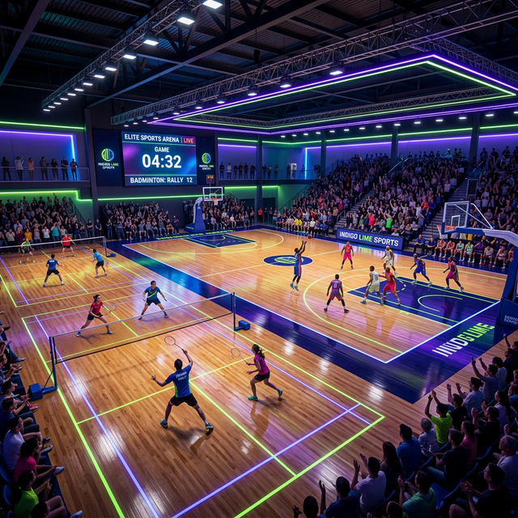

# Arena Sportiva — Premier Sport Hub ⚡



**Arena Sportiva** adalah platform manajemen booking lapangan olahraga (Badminton, Futsal, Basket) berbasis web yang dirancang dengan estetika *Elite-Dominance* dan *Cyber-Industrial*. Sistem ini mengintegrasikan kemudahan reservasi bagi pemain dengan manajemen turnamen dan operasional yang kuat untuk administrator.

## 🔥 Fitur Utama

### 📡 Panel Reservasi & Tracking
- **Interactive Booking Grid:** Jadwal ketersediaan lapangan real-time dengan interval 2 jam.
- **Instant Booking Form:** Alur pemesanan cepat dengan opsi pembayaran Cash atau Transfer.
- **Booking Tracking:** Cek status reservasi (Pending/Booked/Success) dengan kode booking unik.
- **Full-Day Block System:** Kemampuan menutup lapangan secara otomatis untuk pemeliharaan atau event khusus.

### 🏆 Manajemen Turnamen (Event)
- **Competitive Arena Section:** Menampilkan turnamen aktif, prizepool, dan kategori langsung di Homepage.
- **Smart Registration Button:** Integrasi link pendaftaran eksternal (Google Forms/WA) dengan notifikasi otomatis jika link belum tersedia.
- **Automatic Arena Blocking:** Administrator dapat menutup seluruh atau sebagian lapangan secara otomatis selama durasi turnamen melalui panel admin.

### 🏢 Admin Panel (Powered by Filament)
- **Resource Management:** Kelola jenis lapangan, data booking, kategori, dan turnamen dengan mudah.
- **Booking Validation:** Validasi pembayaran manual untuk metode pembayaran Cash.
- **Arena Control:** Tombol "Tutup Lapangan" dan "Buka Lapangan" yang fleksibel untuk mengatur ketersediaan arena.

## 🛠️ Tech Stack

- **Backend:** Laravel 10+
- **Frontend:** Blade Templates, Vanilla CSS (Industrial Cyber Theme), FontAwesome 6+
- **Database:** MySQL
- **Admin Panel:** Filament PHP
- **Utilities:** Carbon (Date handling), Alpine.js (Modal logic)

## 🚀 Cara Instalasi

1. **Clone Repository**
   ```bash
   git clone [url-repository]
   cd Booking-Gor
   ```

2. **Instal Dependencies**
   ```bash
   composer install
   npm install
   ```

3. **Konfigurasi Environment**
   Salin `.env.example` ke `.env` dan sesuaikan pengaturan database Anda.
   ```bash
   cp .env.example .env
   php artisan key:generate
   ```

4. **Migrasi & Seed**
   ```bash
   php artisan migrate
   php artisan db:seed
   ```

5. **Jalankan Server**
   ```bash
   php artisan serve
   npm run dev
   ```

## 🎨 Desain Estetika
Project ini menggunakan tema **Cyber-Industrial** dengan palet warna:
- **Primary:** Neon Green (`#00ffa3`)
- **Accent:** Electric Purple (`#a855f7`) & Amber (`#F59E0B`)
- **Background:** Deep Space Black (`#050505`)

---

**Developed with ⚡ for Elite Performance.**
